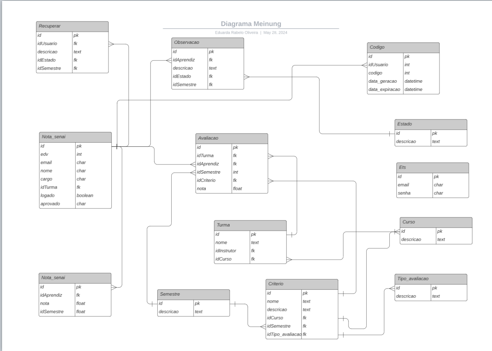

# BackEnd - API

***

## Meinung

Este projeto é uma API RESTful desenvolvida usando Django Rest Framework (DRF) e SQLite para a plataforma de feedbacks Meinung. Para entender melhor a ideia do projeto, acesse a aba **"USUÁRIO"**. Além disso, a documentação da API foi disponibilizada no Swagger para facilitar melhorias e manutenções futuras.

***

### Autenticação

* Para autenticação foi usado `TokenAuthentication`, um método de autenticação baseado em tokens oferecido pelo Django REST framework (DRF). Ele é usado para autenticar solicitações de API usando um token de autenticação que é enviado junto com cada solicitação.
* Caso queira aprender mais, recomendo acessar a documentação oficial:



**Como Funciona**

1. **Geração do Token**: Quando um usuário faz login com credenciais válidas, um token único é gerado e associado ao usuário. Este token é armazenado no banco de dados.
2. **Envio do Token**: Em cada solicitação subsequente à API, o token deve ser incluído no cabeçalho da solicitação HTTP, geralmente usando o cabeçalho `Authorization` com o prefixo `Token`.
3. **Validação do Token**: O DRF verifica o token recebido. Se o token for válido e estiver associado a um usuário ativo, a solicitação é autenticada e processada.

**Configuração**

1.  **Instalação**:&#x20;

    ```sh
    pip install djangorestframework
    ```


2. **Adicionar à INSTALLED\_APPS**:&#x20;

<pre class="language-python"><code class="lang-python">INSTALLED_APPS = [ 
 'rest_framework',
<strong> 'rest_framework.authtoken', 
</strong>]
</code></pre>


3. **Configuração do REST framework**:&#x20;

```python
REST_FRAMEWORK = {
    'DEFAULT_AUTHENTICATION_CLASSES': [
        'rest_framework.authentication.TokenAuthentication',
    ],
}
```


4. **Migrar o banco de dados**:&#x20;

```bash
python manage.py migrate
```


5. **Criação de tokens**:&#x20;

```python

from rest_framework.authtoken.models import Token 
from rest_framework.response import Response 
from rest_framework.views import APIView 
from rest_framework.authentication import TokenAuthentication

class LoginView(APIView): 
    authentication_classes = [TokenAuthentication]
    def post(self, request):    
        # exemplo da lógica de autenticação
        user = authenticate(username=request.data['username'], password=request.data['password'])
        if user:
            # cria ou exibe o token
            token, created = Token.objects.get_or_create(user=user) 
            return Response({'token': token.key})
        else:
            return Response({'error': 'Invalid credentials'}, status=401)
```


6. **Uso do Token**:&#x20;

#### Exemplos

<figure><figcaption><p>Login</p></figcaption></figure>

<figure><figcaption><p>GET</p></figcaption></figure>

***

### Segurança

* Levando em consideração os riscos e as regras de segurança da Bosch, decidimos criptografar certos dados pessoais de cada usuário. Dados pessoais são todas as informações que identificam uma pessoa, como o EDV (número de identificação do empregado), email e senha. Assim, optamos por criptografar esses dados no momento em que o usuário se cadastra. Para implementar essa criptografia, utilizamos a biblioteca Fernet.

#### Fernet

Fernet é uma implementação da criptografia simétrica que faz parte da biblioteca de criptografia do Python, conhecida como `cryptography`. Ele garante que os dados criptografados não possam ser alterados ou lidos sem a chave de criptografia correta. Fernet é projetado para ser fácil de usar e seguro, utilizando os padrões modernos de criptografia.

* Caso queira aprender mais, recomendo acessar a documentação oficial:



**Características Principais**

* **Criptografia Simétrica**: Utiliza a mesma chave para criptografar e descriptografar dados.
* **Autenticidade dos Dados**: Garante que os dados criptografados não foram alterados ou manipulados.
* **Segurança Forte**: Baseado em padrões de criptografia robustos, como AES (Advanced Encryption Standard) em modo CBC (Cipher Block Chaining) com HMAC (Hash-based Message Authentication Code) para integridade.

**Como Funciona**

1. **Geração da Chave**: Uma chave de criptografia é gerada e armazenada em segurança. Esta chave é essencial para criptografar e descriptografar os dados.
2. **Criptografia**: Os dados pessoais, como EDV, email e senha, são criptografados usando a chave gerada. O processo de criptografia transforma os dados em uma forma ilegível.
3. **Descriptografia**: Quando necessário, os dados criptografados podem ser revertidos ao seu estado original usando a mesma chave.

#### Exemplo API

* Instalação

```bash
pip install cryptography
pip install django-fernet-fields
```

* No arquivo `settings.py` a chave de criptografia é acessada no arquivo de variáveis de ambiente (.env) e caso não tenha, ela é criada

```python
from cryptography.fernet import Fernet

# chave de criptografia do banco de dados
FERNET_KEY = os.environ.get('FERNET_KEY')

if not FERNET_KEY:
    FERNET_KEY = Fernet.generate_key().decode()
```

* No arquivo `models.py` os campos são criptografados

```python
from django.db import models
from fernet_fields.fields import EncryptedEmailField, EncryptedIntegerField, EncryptedCharField

class Usuario(AbstractUser, PermissionsMixin):
    """
        Classe abstrata para o usuário com os campos padrões de cadastro
    """
    
     edv = EncryptedIntegerField(null=False, verbose_name="usuário apenas com seu número de edv", default=False)
     email = EncryptedEmailField(max_length=254, null=False, verbose_name="Email")

     def __str__(self):
        return self.nome
```

* No arquivo `views.py` a chave de criptografia é acessada&#x20;

```python
from cryptography.fernet import Fernet
from django.conf import settings

fernet = Fernet(settings.FERNET_KEY)
```


### Autorização

#### Django Roles (permissions)

Para aumentar a segurança, as permissões são configuradas para cada tipo de acesso com base em grupos, conforme o cargo do usuário (Aprendiz, Instrutor, Gestor e Administrador). Para gerenciar essas permissões, utilizamos a biblioteca `django-role-permissions`.

**django-role-permissions**

`django-role-permissions` é uma biblioteca que facilita a implementação de controle de acesso baseado em roles (papéis) em aplicações Django. Ela permite definir claramente as permissões que cada papel possui e aplicar essas permissões de forma consistente em toda a aplicação.

**Características Principais**

* **Definição de Roles**: Permite definir diferentes papéis dentro do sistema, como Aprendiz, Instrutor, Gestor e Administrador. Ou seja, as roles definidas pelo django-role-permissions são baseadas em grupos de permissões. Cada role pode ser associada a um conjunto específico de permissões que determinam as ações que um usuário com essa role pode realizar no sistema. Isso permite uma abordagem flexível e granular para o controle de acesso, onde diferentes tipos de usuários podem ter permissões diferentes com base em suas roles. Isso é útil para organizar e gerenciar as permissões de forma mais eficiente em um aplicativo Django.
* **Atribuição de Permissões**: Associa permissões específicas a cada papel, garantindo que os usuários só possam realizar ações que correspondem ao seu cargo.
* **Facilidade de Uso**: Integra-se facilmente ao sistema de autenticação e autorização do Django, simplificando o gerenciamento de permissões.

**Exemplo API**

* Instalação

```bash
pip install django-role-permissions
```

* As `rolepermissions` são adicionadas à lista de aplicativos instalados no arquivo `settings.py`

```python
INSTALLED_APPS = [

    'rolepermissions',
]
```

* No arquivo `roles.py` as permissões são definidas.

```python
from rolepermissions.roles import AbstractUserRole

class Gestor(AbstractUserRole):
    available_permissions = {'visualizar_rendimento_turmas': True}
```

* No arquivo `permissions.py` essas permissões são aplicadas.

```python
from rest_framework import permissions

class IsGestor(permissions.BasePermission):

    def has_object_permission(self, request, view, obj):
        # verifica  se o usuário tem permissão para realizar uma ação em um objeto específico (como recuperar, atualizar ou excluir um objeto específico)
        return super().has_object_permission(request, view, obj)

    def has_permission(self, request, view): 
        # verifica se o usuário tem permissão para acessar a view em geral
        if not request.user.is_authenticated:
            return False
        return request.user.groups.filter(name='Instrutor').exists()
```

* No arquivo `models.py` as roles são atribuídas aos usuários.

```python
class Usuario(AbstractUser, PermissionsMixin):
    """
        Classe abstrata para o usuário com os campos padrões de cadastro
    """
    # exemplo
    nome = models.CharField(max_length=250, null=False, verbose_name="Nome Completo")

    def check_user_role(self, role):
        """
            Verifica se o usuário pertence a um determinado grupo de permissões, 
            com base no nome do grupo
        """
        return self.groups.filter(name=role).exists()


    def save(self, *args, **kwargs):
        """
            Salva os usuários, verifica o cargo do usuário e atribui o grupo e as permissões correspondentes
        """
        if not self.username:
            self.username = make_password(str(self.edv))  # Criptografa o edv para usar como username

        super().save(*args, **kwargs)

        if self.cargo:
            group_name = self.cargo.capitalize()
            group, created = Group.objects.get_or_create(name=group_name)

            if group_name in permission_role_mapping:
                role_class = permission_role_mapping[group_name]
                permissions = Permission.objects.filter(codename__in=role_class.available_permissions.keys())
                group.permissions.set(permissions)
                self.groups.add(group)
            else:
                return Response(data={"mensagem": "Verifique se esse cargo existe"}, status=status.HTTP_404_NOT_FOUND)
        else:
            return Response(data={"erro": "Tente Novamente"}, status=status.HTTP_401_UNAUTHORIZED)

    def get_permissions(self):
        """
            Esta função retorna todas as permissões do usuário 
            baseado nos grupos e roles aos quais o usuário pertence.
        """
        permissions = set()

        for group in self.groups.all():
            permissions.update(group.permissions.values_list('codename', flat=True))

        for role_name, role_class in permission_role_mapping.items():
            if has_role(self, role_class):
                permissions.update(role_class.available_permissions.keys())

        return permissions

    def __str__(self):
        return self.nome
```

* No arquivo `views.py` ou `viewsets.py` é definido a qual grupo cada classe pertence, para verificar quais serão os acessos permitidos.

```python
class NotaSenaiViewSet(viewsets.ModelViewSet): 
    """
        Função para as notas do senai
    """
    queryset = Nota_senai.objects.all
    serializer_class=NotaSenaiSerializer
    authentication_classes= [TokenAuthentication]
    permission_classes=[IsAuthenticated, IsInstrutor]
```

***

### Testes

* Para melhoria do sistema foi realizado um documento de testes.



***

### Requisitos

* Para o estabelecimento dos requisitos do sistema foi realizado um documento contendo descrições dos requisitos (requisitos funcionais e não funcionais), casos de uso, diagramas UML e análise de riscos.


Documento de requisitos de software


***

### Bibliotecas e Dependências

#### Bibliotecas Principais

* O arquivo `requirements.txt` contém uma lista completa das bibliotecas e suas versões específicas necessárias para rodar o projeto.

```bash
django==4.2.6
django-cors-headers==4.3.1
django-cryptography==1.1
django-environ==0.11.2
django-fernet-fields==0.6
cryptography==42.0.7
django-filter==24.2
django-role-permissions==3.2.0
djangorestframework==3.15.1
drf-yasg==1.21.7
fernet==1.0.1
pandas==2.2.2
```

***

### Banco de dados

* Modelo lógico:

{% embed url="https://lucid.app/lucidchart/3b18e11c-7b82-4f0f-a592-f2567ce4101a/edit?viewport_loc=-147%2C-122%2C2121%2C1493%2C0_0&invitationId=inv_d7a44448-77d4-42f7-82db-1395b84529f6" %}

<figure><figcaption></figcaption></figure>

* As tabelas utilizadas no banco de dados são gerenciadas atualmente pelo SQLite, um banco de dados leve e incorporado, que vem configurado por padrão em novos projetos Django.

***

### Estrutura do Projeto

```
Back-End/
├── .venv
├── api/
│   ├── __pycache__
│   ├── migrations/
│   ├── __init__.py
│   ├── admin.py
│   ├── apps.py
│   ├── authentication.py
│   ├── filters.py
│   ├── managers.py
│   ├── models.py
│   ├── serializers.py
│   ├── tests.py
│   ├── urls.py
│   ├── utils.py
│   ├──views.py
│   └── viewsets.py
├── meinung/
│   ├── __init__.py
│   ├──asgi.py
│   ├──permissions.py
│   ├──roles.py
│   ├── settings.py
│   ├── urls.py
│   └── wsgi.py
├── .env
├── .gitignore
├── db.sqlite3
├── main.py
├── manage.py
├── README.md
├── requirements.txt
├── setup_env.sh
└── start.py
```

***

### Instalação

#### Pré-requisitos

* Python 3.8+
* Django 3.2+
* Django Rest Framework 3.12+

#### Passos

1. Clone o repositório:

```bash
git clone https://github.com/MeinungTCC/Back-End.git

```

2. Crie e ative um ambiente virtual:

```shell
python -m venv .venv
.venv\Scripts\activate
```

3. Configurar as variáveis de ambiente

```bash
cd C:\caminho\para\seu\diretorio
type nul > .env
# no arquivo .env:
SECRET_KEY={YOUR_FERNET_KEY}
DEBUG={YOUR_DEBUG_CONFIG}
FERNET_KEY={YOUR_SECRET_KEY}
```

4. Instale as dependências:

<pre class="language-bash"><code class="lang-bash"><strong>pip install -r requirements.txt
</strong></code></pre>

5. Execute as migrações do banco de dados:

```bash
python manage.py migrate
```

6. Executar o script de pós instalação para configuração do ambiente

<pre class="language-python"><code class="lang-python"><strong>python post_install.py
</strong></code></pre>

7. Criar as migrações&#x20;

```shellscript
python manage.py makemigrations
```

8. Aplicar as migrações

```shellscript
python manage.py migrate
```

9. Criar um superusuário (opcional)

```shellscript
python manage.py createsuperuser
```

10. Rodar o servidor da API

```shellscript
python manage.py runserver
```

***

### Principais Rotas da API

#### Users

* **POST /api/v1/login/**: Login do usuário na plataforma.
* **POST /api/v1/logout/**: Logout do usuário na plataforma.
* **GET /api/v1/usuario/**: Lista todos os usuários (admin).
* **GET /api/v1/usuario/{id}/**: Detalhes de um usuário específico (admin).
* **POST /api/v1/usuario/cadastro/**: Registra um novo usuário.
* **PATCH /api/v1/usuario/{id}/**: Atualiza um usuário específico (admin).
* **DELETE /api/v1/usuario/{id}/**: Deleta um usuário específico (admin).

#### Admin

* **GET /api/v1/admin/lista/**: Lista todos os usuários cadastrados como administradores.

#### Aprendiz

* **GET /api/v1/aprendiz/lista/**: Lista todos os usuários cadastrados como aprendizes.
* **GET /api/v1/aprendiz/espera/**: Lista todos os aprendizes em que o cadastro está em espera.
* **GET /api/v1/aprendiz/aprovado/**: Lista todos os aprendizes em que o cadastro foi aprovado.

#### Instrutor

* **GET /api/v1/instrutor/lista/**: Lista todos os usuários cadastrados como instrutores.
* **GET /api/v1/instrutor/espera/**: Lista todos os instrutores em que o cadastro está em espera.
* **GET /api/v1/instrutor/aprovado/**: Lista todos os instrutores em que o cadastro foi aprovado.

#### Gestor

* **GET /api/v1/gestor/lista/**: Lista todos os usuários cadastrados como gestores.
* **GET /api/v1/gestor/espera/**: Lista todos os gestores em que o cadastro está em espera.
* **GET /api/v1/gestor/aprovado/**: Lista todos os gestores em que o cadastro foi aprovado.

#### POST

* **POST /api/v1/curso/**: Registra um novo curso.
* **POST /api/v1/turma/**: Registra uma nova turma.
* **POST /api/v1/semestre/**: Registra um novo semestre.
* **POST /api/v1/tipo/avaliacao/**: Registra um novo tipo de avaliação (avaliação ou autoavaliação).
* **POST /api/v1/criterio/**: Registra um novo criterio.
* **POST /api/v1/estado/**: Registra um novo estado para a observação (positivo ou melhoria).
* **POST /api/v1/observacao/**: Registra uma nova observação do instrutor.
* **POST /api/v1/avaliacao/**: Registra uma nova avaliação do instrutor.
* **POST /api/v1/autoavaliacao/**: Registra uma nova autoavaliação do aprendiz.

#### GET

* **GET /api/v1/rendimento/aprendiz/{id\_semestre1}/{id\_semestre2}/**: O aprendiz pode comparar as notas entre dois semestres.
* **GET/api/v1/rendimento/aprendizes/{id\_aprendiz1}/{id\_aprendiz2}/{id\_semestre}/{id\_criterio}/**: O instrutor pode comparar as notas de dois aprendizes, selecionando por um semestre e critério específico.
* **GET /api/v1/autoavaliacao/{id}/**: Lista as notas das autoavaliações de um aprendiz específico.
* **GET /api/v1/avaliacao/media/{idAprendiz}/{idTurma}/{idSemestre}/**: Mostra a média da avaliação do aprendiz em um semestre específico.
* **GET /api/v1/avaliacao/detalhes/{idAprendiz}/{idSemestre}/**: Lista os detalhes da avaliação de um aprendiz de um semestre específico, é possível visualizar tanto as notas como as observações.
* **GET /api/v1/feedback/{idAprendiz}/{idTurma}/{idSemestre}/**: Lista as notas finais da avaliação do aprendiz e os detalhes da avaliação de acordo com o semestre, rota feita para o instrutor poder realizar o feedback.
* **GET /api/v1/rendimento/turmas/{turma1\_id}/{turma2\_id}/{semestre\_id}/**: O gestor pode comparar as notas de duas turmas, selecionando por um semestre específico.

#### PATCH

* **PATCH /api/v1/autoavaliacao/{id}/**: O instrutor consegue editar as notas da autoavaliação de um aprendiz em específico.
* **PATCH /api/v1/avaliacao/{id}/**: O instrutor consegue editar as notas da avaliação de um aprendiz em específico.
* **PATCH /api/v1/critério/{id}/**: O administrador consegue editar o critério que deseja.
* **PATCH /api/v1/critério/{id}/**: O administrador consegue editar a turma que deseja.
* **PATCH /api/v1/curso/{id}/**: O administrador consegue editar o curso que deseja.

#### DELETE

* **DELETE /api/v1/curso/{id}/**: O administrador consegue deletar o curso que deseja.
* **DELETE /api/v1/criterio/{id}/**: O administrador consegue deletar o criterio que deseja.
* **DELETE /api/v1/turma/{id}/**: O administrador consegue deletar a turma que deseja.

***

### Arquitetura da API

#### Models

O arquivo `models.py` contém as definições dos modelos de dados.

```python
### Models
from django.db import models

class Curso(models.Model):
    """
        Model com o nome de cada curso.
    """
    descricao = models.CharField(max_length=255, null=False) # nome do curso

    class Meta:
        verbose_name = "Curso"
        verbose_name_plural = "Cursos"
    
    def __str__(self):
        return self.descricao
```

#### Admin

O arquivo `admin.py` registra os modelos para que eles apareçam no site de administração do Django.

```python
from django.contrib import admin
from api.models import *
from meinung.roles import *

class CursoAdmin(admin.ModelAdmin):
    """
        define como os dados desse modelo serão exibidos 
        e manipulados na interface administrativa do Django.
    """
    list_display = ('descricao', ) # quais campos do modelo serão exibidos na lista de registros no admin
    list_display_links = ('descricao', ) # quais campos da lista de registros são clicáveis e levam para a página de detalhes do registro
    list_per_page = 10 # quantos registros serão exibidos por página na lista de registros
```

#### Serializers

O arquivo `serializers.py` contém as definições dos serializers. Exemplo:

```python
from rest_framework import serializers
from api.models import *

class CursoSerializer(serializers.ModelSerializer):
    class Meta:
        model = Curso
        fields = '__all__'
```

#### Views/Viewsets

O arquivo `views.py`  e `viewsets.py` contém as definições das views da API. Exemplo:

```python
from rest_framework import viewsets
from api.models import *
from api.serializers import *

class CursoViewSet(viewsets.ModelViewSet):
    """
        Função para cadastro dos cursos
    """
    queryset = Curso.objects.all()
    serializer_class=CursoSerializer
    authentication_classes= [TokenAuthentication]
    permission_classes=[IsAuthenticated, IsAdministrador]

    # Implementação da função list para listar todos os objetos
    def list(self, request, *args, **kwargs):
        queryset = self.get_queryset()  # Obtém a lista de objetos
        serializer = self.get_serializer(queryset, many=True)
        return Response(serializer.data)

    def create(self, request, *args, **kwargs):
        serializer=self.serializer_class(data=request.data)
        if serializer.is_valid():
            serializer.save()
            return Response(serializer.data, status=status.HTTP_201_CREATED)
        return Response(serializer.errors, status=status.HTTP_400_BAD_REQUEST)
    
    # Implementação da função retrieve para recuperar um objeto pelo ID
    def retrieve(self, request, *args, **kwargs):
        instance = self.get_object()  # Obtém a instância do objeto com base no ID
        serializer = self.get_serializer(instance)
        return Response(serializer.data)
    
    # Implementação da função destroy para excluir pelo ID
    def destroy(self, request, *args, **kwargs):
        instance = self.get_object()  
        self.perform_destroy(instance)
        return Response(status=status.HTTP_200_OK)
    
    # Implementação da função update para atualizar um objeto existente
    def update(self, request, *args, **kwargs):
        partial = kwargs.pop('partial', False)
        instance = self.get_object()  
        serializer = self.get_serializer(instance, data=request.data, partial=partial)
        serializer.is_valid(raise_exception=True)
        self.perform_update(serializer)
        return Response(serializer.data)
        
```

```python
from rest_framework import generics

class AllAprendizListView(generics.ListAPIView):
    """
        Lista todos os aprendizes cadastrados
    """
    serializer_class = UsuarioSerializer
    authentication_classes= [TokenAuthentication]
    permission_classes=[IsAuthenticated, IsAdministrador]

    def get_queryset(self):
        return Usuario.objects.filter(cargo='aprendiz') 

class AprendizEsperaListView(generics.ListAPIView):
    """
        Verifica os aprendizes em que o cadastro está em espera
    """
    serializer_class = UsuarioSerializer
    authentication_classes= [TokenAuthentication]
    permission_classes=[IsAuthenticated, IsAdministrador]

    def get_queryset(self):
        return Usuario.objects.filter(cargo='aprendiz', status='em espera') 

class AprendizAprovadoListView(generics.ListAPIView):
    """
        Verifica os aprendizes em que o cadastro está aprovado
    """
    queryset = Usuario.objects.all()
    serializer_class = UsuarioSerializer
    authentication_classes= [TokenAuthentication]
    permission_classes=[IsAuthenticated, IsAdministrador]

    def get_queryset(self):
        return Usuario.objects.filter(cargo='aprendiz', status='aprovado')  
```

#### URLs

O arquivo `urls.py` da aplicação contém as rotas da API. Exemplo:

```python
from django.urls import path, include
from api import viewsets as apiviewsets
from rest_framework import routers
from api import urls as apiurls

route = routers.DefaultRouter()

route.register(r'curso', apiviewsets.CursoViewSet, basename="curso")

urlpatterns = [
     path('admin/', admin.site.urls),
     path('api/v1/', include(route.urls)),
     path('api/v1/', include(apiurls)),
]
```


Com essa documentação, você deve ter uma visão geral de como a API está estruturada e como interagir com suas principais rotas.
