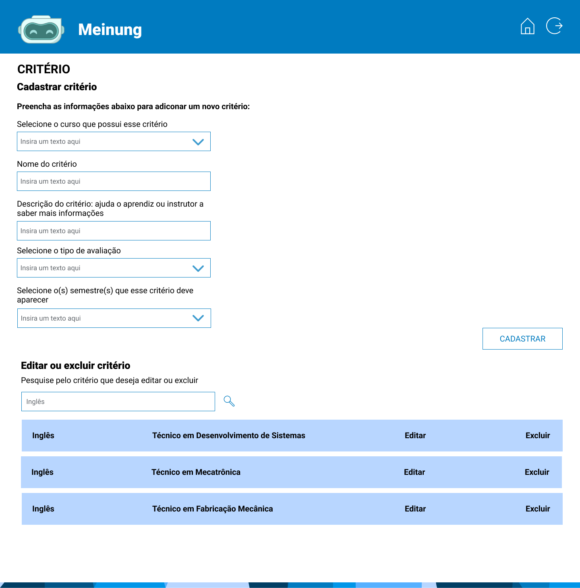

# 👤 Administrador

### Contextualização

O administrador tem o papel de gerenciar os cadastros na plataforma, os critérios da avaliação e auto avaliação, turmas, e-mail de recuperação de senha e notas do SENAI.

Tela de home onde é exibido as funcionalidades desse acesso.&#x20;

<figure><figcaption></figcaption></figure>

Tela onde o administrador vai cadastrar uma turma preenchendo os campos abaixo.

Se desejar editar uma turma existente, é só pesquisar o nome da turma e clicar em editar para ser direcionado para a próxima página.

<figure><figcaption></figcaption></figure>

Tela de edição de turma. Para editar a turma selecionada, basta preencher os campos abaixo e salvar.

<figure><figcaption></figcaption></figure>

Tela onde o administrador vai cadastrar um critério preenchendo os campos abaixo.

Se desejar editar um critério existente, é só pesquisar o nome do critério e clicar em editar para ser direcionado para a próxima página.

<figure><figcaption></figcaption></figure>

Tela de edição de critério. Para editar o critério selecionado, basta preencher os campos abaixo e salvar.&#x20;

<figure><figcaption></figcaption></figure>

Tela para fazer o upload do arquivo excel com as notas do Senai. Ao clicar em enviar, o arquivo será salvo no banco de dados, será somada a média de cada aluno e enviada para o acesso do instrutor.

<figure><figcaption></figcaption></figure>

Tela para editar o email, senha ou apenas um. Esse email é o email que enviará o código de recuperação de senha.

<figure><figcaption></figcaption></figure>

Tela onde o administrador vai aceitar ou recusar os cadastros na plataforma.

<figure><figcaption></figcaption></figure>

