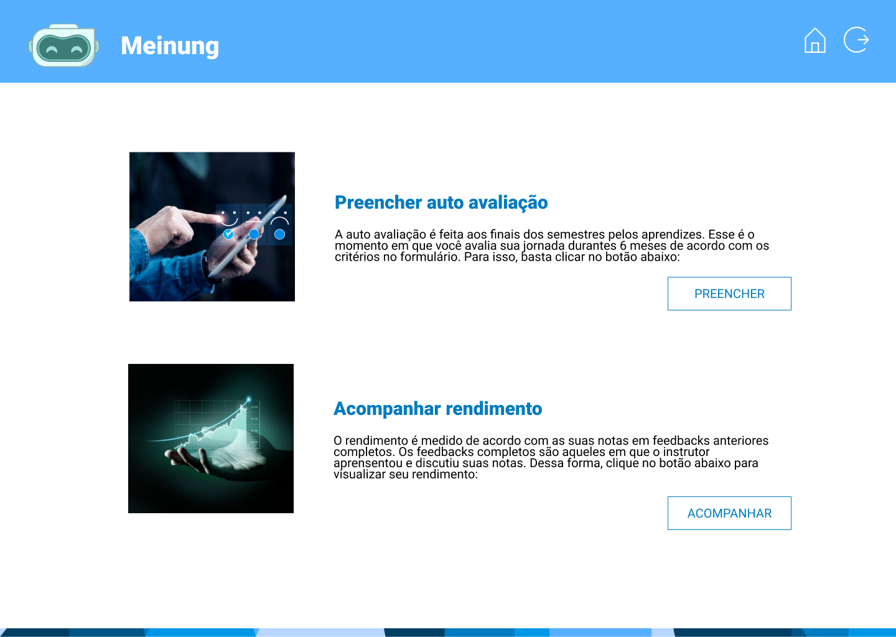
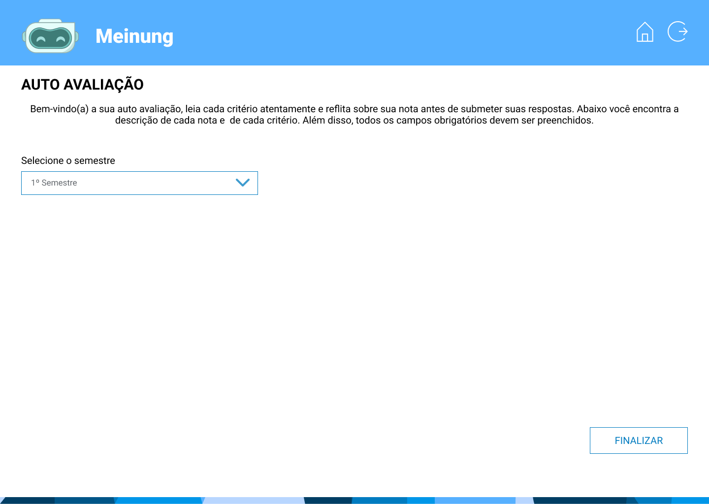
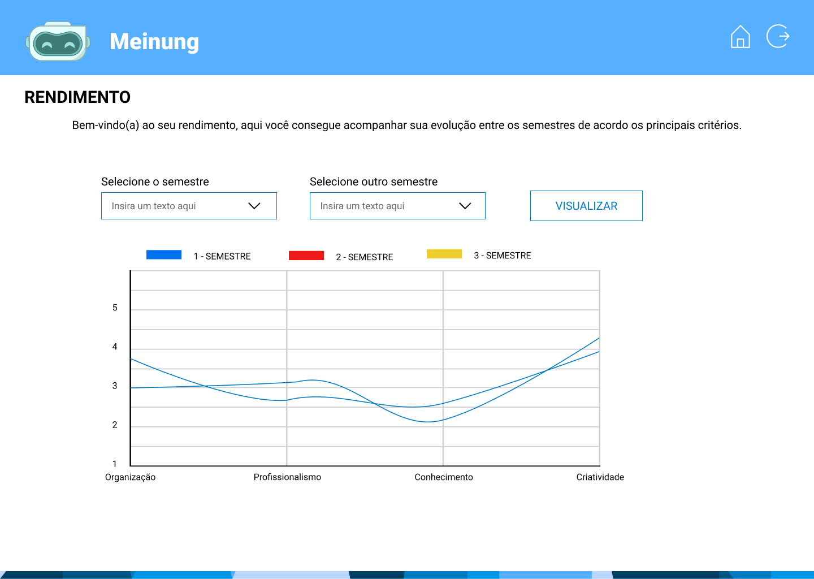

# 🎓 Aprendiz

### Contextualização

O acesso do aprendiz permite que o aprendiz faça sua auto avaliação com base nos critérios definidos pelos instrutores, além de poder acompanhar seu rendimento ao longo dos semestres.

O acesso de aprendiz para o aprendiz de administração permite que ele faça uma avaliação da área em que está atuando, além de também poder acompanhar seu rendimento.

Home onde mostra as funcionalidades do aceso de aprendizes dos cursos de Soluções Digitais, Mecatrônica e Manufatura Digital.&#x20;

<figure><figcaption></figcaption></figure>

Tela onde o aprendiz fará sua alto avaliação. Selecionando o semestre, aparecerá os critérios definidos para cada curso.

<figure><figcaption></figcaption></figure>

Tela onde o aprendiz poderá ver o seu rendimento em cada semestre.

<figure><figcaption></figcaption></figure>

Home onde mostra as funcionalidades do aceso de aprendizes do curso de Administração

<figure><figcaption></figcaption></figure>

Tela onde o aprendiz fará a avaliação da área. Selecionando o semestre, aparecerá os critérios definidos para este curso.

<figure><figcaption></figcaption></figure>
